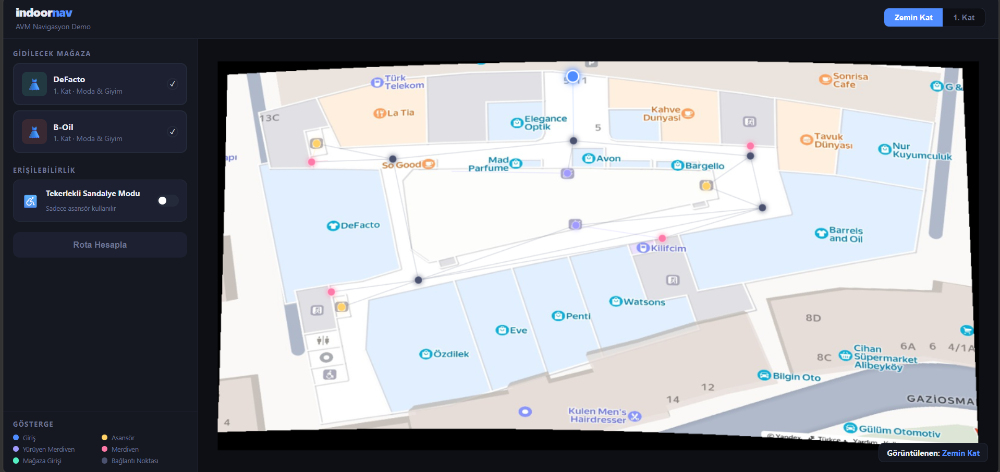
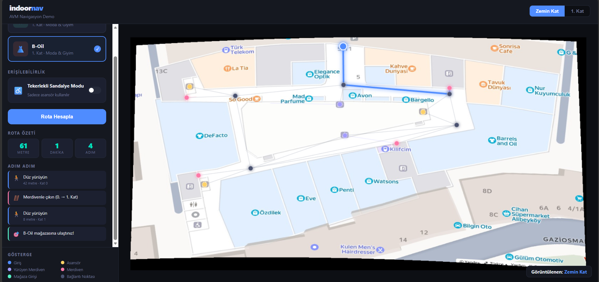
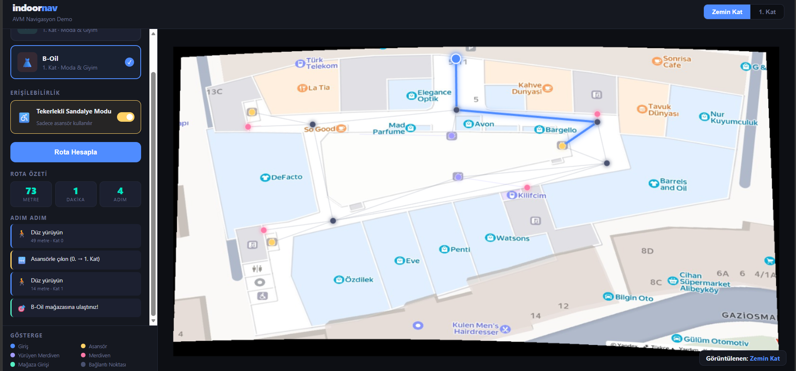

# 🗺️ Indoor Navigation Demo

An indoor navigation demo built with pure HTML/CSS/JavaScript, running on georeferenced mall (İstanbul BizCevahir AVM) YandexMaps floor plans prepared in QGIS.

🔗 **Live Demo:** [https://SametBucak.github.io/indoor-nav](https://SametBucak.github.io/indoor-nav)

---

## Screenshots

<!-- Add your screenshots below. Recommended size: 1280x720px -->

**Main View**


**Route Planning**


**Wheelchair Mode**


---

## Features

- 🏢 Multi-floor plan viewer (Ground Floor / Floor 1)
- 🧭 Shortest path calculation using Dijkstra's algorithm
- ♿ Wheelchair accessibility mode (elevator only, no stairs or escalators)
- 📋 Step-by-step navigation instructions
- 🔍 Pan & zoom (mouse wheel, drag, pinch-to-zoom on touch)
- 🗺️ Georeferenced floor plans (EPSG:3857 → WGS84)
- 📂 GeoJSON-driven data — update QGIS exports without touching JS code

---

## Project Structure

```
indoor-nav/
├── index.html              
├── css/
│   └── style.css           
├── js/
│   ├── data.js            
│   ├── graph.js            
│   ├── renderer.js         
│   ├── ui.js               
│   └── main.js             
├── assets/
│   ├── floor-0.png         
│   ├── floor-1.png         
│   ├── nodes.geojson       
│   └── edges.geojson       
├── docs/
│   └── screenshots/        
│       ├── main-view.png
│       ├── route-planning.png
│       └── wheelchair-mode.png
├── .gitignore
└── README.md
```

---

## Running Locally

The project uses `fetch()` to load GeoJSON files, so it must be served over HTTP — opening `index.html` directly in a browser will not work.

**Option 1 — Python (recommended):**
```bash
python3 -m http.server 8080
```
Then open [http://localhost:8080](http://localhost:8080)

**Option 2 — Node.js:**
```bash
npx serve .
```

**Option 3 — VS Code Live Server:**
Install the [Live Server](https://marketplace.visualstudio.com/items?itemName=ritwickdey.LiveServer) extension, right-click `index.html` → **Open with Live Server**.

---

## Data Format

### Node properties (`assets/nodes.geojson`)

| Field   | Type   | Description                                                                 |
|---------|--------|-----------------------------------------------------------------------------|
| `id`    | number | Unique identifier                                                           |
| `name`  | string | Display name                                                                |
| `floor` | number | Floor number (0 = ground)                                                   |
| `type`  | string | `entrance`, `elevator`, `escalator`, `stair`, `store_entrance`, `node`      |

Coordinates are in **EPSG:3857** (Web Mercator) — conversion to WGS84 is handled automatically by `data.js`.

### Edge properties (`assets/edges.geojson`)

| Field        | Type   | Description                                       |
|--------------|--------|---------------------------------------------------|
| `from_id`    | number | Start node id                                     |
| `to_id`      | number | End node id                                       |
| `distance`   | number | Distance in meters                                |
| `accesstype` | string | `walk`, `elevator`, `escalator`, `stair`          |

---

## Updating Map Data

When you make changes in QGIS, simply replace the GeoJSON files and push:

```bash
# Replace assets/nodes.geojson and assets/edges.geojson with new exports
git add .
git commit -m "data: updated nodes and edges"
git push
```

No JavaScript changes needed.

---

## Adding a New Floor

1. Export the floor plan image as PNG → place in `assets/floor-N.png`
2. Add geographic bounds to `GEO_BOUNDS` in `js/data.js`
3. Add nodes and edges to the GeoJSON files in QGIS
4. Add the new image path to `FLOOR_IMAGES` in `js/main.js`
5. Add a new floor button to `index.html`

---

## Node Type Colors

| Type             | Color  | Description          |
|------------------|--------|----------------------|
| `entrance`       |  Blue   | Building entrance    |
| `elevator`       |  Yellow | Elevator             |
| `escalator`      |  Purple | Escalator            |
| `stair`          |  Pink   | Staircase            |
| `store_entrance` |  Green  | Store entrance       |
| `node`           |  Dark   | Routing waypoint     |

---

## Tech Stack

- Pure HTML / CSS / JavaScript — zero dependencies
- Canvas 2D API for map rendering
- Dijkstra's algorithm for shortest path
- QGIS for floor plan georeferencing (EPSG:3857)

---

